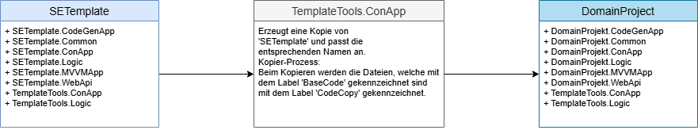

SETemplateBase – Vorlage für Software-Architektur-Projekte

Die SETemplateBase ist eine wiederverwendbare Projektvorlage, die auf dem Konzept von [SEArchitecture](https://github.com/leoggehrer/SEArchitecture) basiert. Sie dient als technische Grundlage für Anwendungen, die einer strukturierten und wartbaren Software-Architektur folgen sollen und ermöglicht die schnelle und einheitliche Erstellung neuer Projekte.

Zielgruppe
Entwickler:innen, die auf Basis der definierten Architektur schnell Projekte aufsetzen, anpassen und erweitern wollen.

---

## Projektübersicht

|Projekt|Beschreibung|Typ|Abhaengigkeit|
|---|---|---|---|
|**SETemplate.Common** |In diesem Projekt werden alle Hilfsfunktionen, allgemeine Erweiterungen und Schnittstellen zusammengefasst. Diese sind unabhaengig vom Problembereich und koennen auch in andere Domaen-Projekte wiederverwendet werden.| Library | keine |
|**SETemplate.Logic**|Dieses Projekt beinhaltet den vollstaendigen Datenzugriff, die gesamte Geschaeftslogik und stellt somit den zentralen Baustein des Systems dar.| Library | SETemplate.Common |
|**SETemplate.Logic.UnitTest**|In diesem Projekt befinden sich die Unit-Tests fuer die gesamte Geschaeftslogik.| MSTest | SETemplate.Common, SETemplate.Logic |
|**SETemplate.WebApi**|In diesem Projekt ist die REST-Schnittstelle implementiert. Dieses Modul stellt eine API (Aplication Programming Interface) fuer den Zugriff auf das System ueber das Netzwerk zur Verfuegung.| Host | SETemplate.Logic |
|**SETemplate.ConApp**|Dieses Projekt dient als Initial-Anwendung zum Erstellen der Datenbank, das Anlegen von Anmeldedaten falls die Authentifizierung aktiv ist und zum Importieren von bestehenden Daten. Nach der Initialisierung wird diese Anwendung kaum verwendet.| Console | SETemplate.Logic |
|**SETemplate.MVVMApp**|Diese Projekt beinhaltet die Basisfunktionen fuer eine Wpf-Anwendung (Avalonia) und kann als Vorlage fuer die Entwicklung einer einer Wpf-Anwendung mit dem SETemplate Framework verwendet werden.|Host| SETemplate.Logic |
|**SETemplate.XxxYyy**|Es folgen noch weitere Vorlagen von Client-Anwendungen wie Angular, Blazor und mobile Apps. Zum jetzigen Zeitpunkt existiert nur die AspMvc-Anwendung und Wpf-Anwendung. Die Erstellung und Beschreibung weiterer Client-Anwendungen erfolgt zu einem spaeteren Zeitpunkt.| Host | SETemplate.Logic |

---

## Voraussetzungen

- [.NET SDK 8.0](https://dotnet.microsoft.com/en-us/download/dotnet/8.0)
- Visual Studio 2022 (oder JetBrains Rider)
- Visual Studio Code (mit den entsprechenden Extensions)
- Git

## Arbeitsweise von `SETemplate`

### Projekterstellung  

Die nachfolgenden Abbildung zeigt den schematischen Erstellungs-Prozess für ein Domain-Projekt:  
  
  
  
Als Ausgangsbasis wird die Vorlage ***SETemplate*** verwendet. Diese Vorlage wird mit Hilfe dem Hilfsprogramm ***'TemplateTools.ConApp'*** in ein Verzeichnis eigener Wahl kopiert. Bei der Erstellung des Domain-Projektes **SEBookStore** werden die folgenden Aktionen ausgefuehrt:

- Alle Projektteile aus der Vorlage werden in das Zielverzeichnis kopiert.
- Die Namen der Projekte und Komponenten werden entsprechend angepasst.
- Alle Projekte mit dem Prefix **SETemplate** werden mit dem domainspezifischen Namen erstezt.
- Beim Kopieren der Dateien wird der Label **@BaseCode** mit dem Label **@CodeCopy** ersetzt (Diese Labels werden fur einen späteren Abgleich-Prozess verwendet).

Nach dem der Erstellungsprozess ausgeführt wurde, haben Sie eine weiters Projekt (Solution) erhalten - ein Domain-Projekt.

  

> **Hinweis:** Die beiden Projekte 'SETemplate' und 'DomainProjekt' können zu einem späteren Zeitpunkt abgeglichen werden.

## Verwendung der Vorlage

### 1. Repository klonen

```bash
git clone https://github.com/leoggehrer/SETemplate.git
cd SETemplate
```

## Verwendung der Vorlage
  
Nachfolgend werden die einzelnen Schritte von der Vorlage ***SETemplate*** bis zum konkreten Projekt ***SEBookStore*** erläutert. Das Projekt ist eine einfache Anwendung zur Demonstration von der Verwendung der Vorlage. Im Projekt ***SEBookStore*** werden Bücher und deren Daten verwaltet. Das Datenmodell ist sehr einfach und besteht aus einer Entität.  

## Aufgabenbeschreibung **BookStrore**

### Datenmodell und Datenbank

Das Datenmodell für ***BookStore*** hat folgenden Aufbau:

```txt
+-------+--------+ 
|                | 
|     Book       + 
|                | 
+-------+--------+ 
```

#### Definition von ***Book***

| Name          | Type   | MaxLength | Nullable |Unique|Db-Field|Access|
|---------------|--------|-----------|----------|------|--------|------|
| Id            | int    | --------- | -------- | ---- | Yes    | R    |
| ISBNNumber    | String | 10        | No       | Yes  | Yes    | RW   |
| Author        | String | 128       | No       | Yes+ | Yes    | RW   |
| Title         | String | 256       | No       | Yes+ | Yes    | RW   |
| Description   | String | 1024      | Yes      | No   | Yes    | RW   |
| YearOfRelease | int    | --------- | -------- | No   | Yes    | RW   |
| Price         | double | --------- | -------- | No   | Yes    | RW   |

+...beide zusammen sind eindeutig

### Business-Logik  

Das System muss einige Geschäftsregeln umsetzen. Diese Regeln werden im Backend implementiert und müssen mit UnitTests überprüft werden.

> **HINWEIS:** Unter **Geschäftsregeln** (Business-Rules) versteht man **elementare technische Sachverhalte** im Zusammenhang mit Computerprogrammen. Mit *WENN* *DANN* Scenarien werden die einzelnen Regeln beschrieben.  

Für den ***BookStore*** sind folgende Regeln definiert:

| Rule | Subject | Type   | Operation | Description | Note |
|------|---------|--------|-----------|-------------|------|
|**A1**| Book    |        |           |             |      |
|      |         |**WENN**|           | eine *Book* erstellt oder bearbeitet wird, |  |
|      |         |**DANN**|           | muss die `ISBNNumber` festgelegt sein und gültig sein (die Regen finden Sie im Abschnitt **Prüfung der ISBN-Nummern**. | |
|**A2**| Book    |        |           |             |      |
|      |         |**WENN**|           | eine *Book* erstellt oder bearbeitet wird, |  |
|      |         |**DANN**|           | muss der `Author` festgelegt sein und mindestens 3 Zeichen lang sein. | |
|**A3**| Book    |        |           |             |      |
|      |         |**WENN**|           | eine *Book* erstellt oder bearbeitet wird, |  |
|      |         |**DANN**|           | muss der `Title` festgelegt sein und mindestens 5 Zeichen lang sein. | |
|**A4**| Book    |        |           |             |      |
|      |         |**WENN**|           | eine *Book* erstellt oder bearbeitet wird, |  |
|      |         |**DANN**|           | muss die `YearOfRelease` festgelegt und im im Bereich von 1900 bis aktuelles Datum + 1 Jahr sein. | |
|**A5**| Book    |        |           |             |      |
|      |         |**WENN**|           | eine *Book* erstellt oder bearbeitet wird, |  |
|      |         |**DANN**|           | muss der `Price` festgelegt und im Bereich von 1 EUR bis 10.000 EUR sein. | |

**Hinweis:** Falls einer der Geschäftsregeln nicht erfüllt ist, muss eine **BusinessRuleException** mit einer entsprechenden Fehlermeldung (in Englisch) geworfen werden.

#### Prüfung der ISBN-Nummern

Die **Prüfziffer (10. Ziffer)** der ISBN-Nummer wird so berechnet:

1. Multipliziere jede der ersten 9 Ziffern mit ihrer Position (1 bis 9).  
2. Summiere alle Produkte.  
3. Teile die Summe ganzzahlig durch 11.  
4. Der **Rest** ist die Prüfziffer. Falls der Rest 10 ist, ist die Prüfziffer **„X“**.

#### Beispiele:

1. **ISBN 3-499-13599-[?]**  
   `3·1 + 4·2 + 9·3 + 9·4 + 1·5 + 3·6 + 5·7 + 9·8 + 9·9 = 285`  
   `285 % 11 = 10` ⇒ Prüfziffer: **X**

2. **ISBN 3-446-19313-[?]**  
   `3·1 + 4·2 + 4·3 + 6·4 + 1·5 + 9·6 + 3·7 + 1·8 + 3·9 = 162`  
   `162 % 11 = 8` ⇒ Prüfziffer: **8**

3. **ISBN 0-7475-5100-[?]**  
   `0·1 + 7·2 + 4·3 + 7·4 + 5·5 + 5·6 + 1·7 + 0·8 + 0·9 = 116`  
   `116 % 11 = 6` ⇒ Prüfziffer: **6**

4. **ISBN 1-57231-422-[?]**  
   `1·1 + 5·2 + 7·3 + 2·4 + 3·5 + 1·6 + 4·7 + 2·8 + 2·9 = 123`  
   `123 % 11 = 2` ⇒ Prüfziffer: **2**

**Hinweis:** Wenn die ISBN-Prüfziffer nicht korrekt ist, **muss eine Ausnahme geworfen werden.**

### Datenimport

Erstellen Sie ein Konsolenprogramm welches die Datenbank erzeugt und die beigelegte csv-Datei in die Datenbank importiert. Falls es beim Import zu Fehlern kommt (z.B. ISBN-Prüfziffer falsch), muss eine entsprechende Fehlermeldung ausgegeben werden.


## Umsetzung der Aufgabe mit dem `SETemplate`

### Starten Sie die Anwendung `TemplateTools.ConApp`

Nach dem Start von `TemplateTools.ConApp` wird folgendes Menü angezeigt:

```bash
==============
Template Tools
==============

Force flag:    False
Solution path: ...\SETemplate

[ ----] -----------------------------------------------------------------
[    1] Force...............Change force flag
[    2] Path................Change solution path
[ ----] -----------------------------------------------------------------
[    3] Copier..............Copy this solution to a domain solution
[    4] Preprocessor........Setting defines for project options
[    5] CodeGenerator.......Generate code for this solution
[    6] Comparison..........Compares a project with the template
[    7] Cleanup.............Deletes the temporary directories
[-----] -----------------------------------------------------------------
[  x|X] Exit................Exits the application

Choose [n|n,n|a...all|x|X]:
```

Wählen Sie den Menüpunkt 'Copier' aus und setzen Sie den 'Target name' auf 'SEBookStore':

```bash
===============
Template Copier
===============

'SETemplate' from: ...\SETemplate
  -> copy ->
'SEBookStore' to:  ...\SEBookStore

[  ---] -----------------------------------------------------------------
[    1] 1...................Change max sub path depth
[    2] Source path.........Change the source solution path
[    3] Target path.........Change the target solution path
[    4] Target name.........Change the target solution name
[  ---] -----------------------------------------------------------------
[    5] Start...............Start copy process
[-----] -----------------------------------------------------------------
[  x|X] Exit................Exits the application

Choose [n|n,n|a...all|x|X]:
```

Nun können Sie die Projekt-Erstellung mit dem Menüpunkt 5 starten. Nach dem Vorgang hat das System einen Ordner mit dem Namen 'SEBookStore' erstellt und die einzelnen Projekte kopiert:


## Umsetzung der Aufgabe

Öffnen Sie die Projektmappe 'SEBookStore' mit der IDE und beginnen Sie nun mit der Erstellung der Entität `Book`:

### Erstellung der Entität `Book`

```csharp
namespace SEBookStore.Logic.Entities
{
    /// <summary>
    /// Represents a book entity.
    /// </summary>
    [Table("Books")]
    [Index(nameof(ISBNNumber), IsUnique = true)]
    [Index(nameof(Author), nameof(Title), IsUnique = true)]
    public partial class Book : EntityObject
    {
        private string iSBNNumber = string.Empty;

        /// <summary>
        /// Gets or sets the ISBN number of the book.
        /// </summary>
        [Required, MaxLength(10)]
        public string ISBNNumber 
        { 
            get => iSBNNumber; 
            set => iSBNNumber = value.Replace("-", string.Empty); 
        }
        /// <summary>
        /// Gets or sets the author of the book.
        /// </summary>
        [Required, MaxLength(128)]
        public string Author { get; set; } = string.Empty;

        /// <summary>
        /// Gets or sets the title of the book.
        /// </summary>
        [Required, MaxLength(256)]
        public string Title { get; set; } = string.Empty;

        /// <summary>
        /// Gets or sets the description of the book.
        /// </summary>
        [Required, MaxLength(2048)]
        public string Description { get; set; } = string.Empty;

        /// <summary>
        /// Gets or sets the year of release of the book.
        /// </summary>
        public int YearOfRelease { get; set; }

        /// <summary>
        /// Gets or sets the price of the book.
        /// </summary>
        public double Price { get; set; }

        public override string ToString()
        {
            return $"{Author} - {Title}";
        }
    }
}
```

> **Erstellungsrichtlinien:** 
>* Erstellen Sie sie Entität-`Book` als `public partial class Book`-Klasse.
>* Leiten Sie die Entität-`Book` von `EntityObject` oder `VersionEntityObject` ab.
>* Geben Sie den Tabellenname als Klassen-Attribut `[Table("...")]` über der Klasse an.
>* Erstellen Sie alle Eigenschaften und deren Einschränkungen `[MaxLength(10)]`.
>* Geben Sie alle Index-Einschränkungen als Klassen-Attribute `[Index(..., IsUnique = true)]` an.

**Prüfung der Entität `Book`:**

| Klasse  | Prüfung                                       | Ergebnis | Beschreibung |
|---------|-----------------------------------------------|----------|--------------|
| `Book`  | Ist die Klasse als `public partial class Book` deklariert? | Ja | Wenn nein, tritt ein Fehler beim Verbinden von der Schnittstelle `IBook` mit dem `Book` Klasse auf. |
| `Book`  | Ist die Klasse von `EntityObject` oder `VersionEntityObject` abgeleitet? | Ja | Wenn nein, wird `Book` nicht als Entität erkannt. |
| `Book`  | Ist die Klasse mit dem Attribut `[Table("...")]` versehen? | Ja | Wenn nein, wird ein Standardnamen vergeben. |
| `Book`  | Sind die Eigenschaften mit den Attributen `[MaxLength(...)]` versehen? | Ja | Wenn nein, werden die Standardwerte verwendet. |
| `Book`  | Sind die Eigenschaften mit den Attributen `[Required]` versehen? | Ja | Wenn nein, werden die Standardwerte verwendet (Abhängig von der `dotnet`- Version). |
| `Book`  | Sind die Eigenschaften mit den Attributen `[Index(..., IsUnique = true)]` versehen? | Ja | Wenn nein, wird kein Index erstellt. |

### Erstellung der Validierungen für die Entität `Book`

Im nächsten Schritt implementieren Sie die Geschäftsregeln für die Entität-`Book`:
 
> **Tipp:** Erstellen Sie eine weiter `partial`-Klasse und implementieren Sie die Schnittstelle `IValidatableEntity`. Diese Schnittstelle ist in der Datei `SETemplate.Common/Contracts/IValidatableEntity.cs` definiert. Verwenden Sie als Dateinamen `BookValidation.cs`. 

```csharp
using SEBookStore.Logic.Contracts;
using SEBookStore.Logic.Exceptions;

namespace SEBookStore.Logic.Entities
{
    /// <summary>
    /// Represents a book entity with validation logic.
    /// </summary>
    partial class Book : IValidatableEntity
    {
        /// <summary>
        /// Validates the properties of the book entity.
        /// </summary>
        /// <param name="context">The context in which the validation is performed.</param>
        /// <exception cref="BusinessException">
        /// Thrown when any of the following validation rules are violated:
        /// <list type="bullet">
        /// <item><description>The ISBN number is invalid.</description></item>
        /// <item><description>The author's name is less than 3 characters long.</description></item>
        /// <item><description>The title is less than 5 characters long.</description></item>
        /// <item><description>The year of release is not between 1900 and the next calendar year.</description></item>
        /// <item><description>The price is not between EUR 1 and EUR 10,000.</description></item>
        /// </list>
        /// </exception>
        public void Validate(IContext context)
        {
            // A1
            if (CheckISBNNumber(ISBNNumber) == false)
            {
                throw new BusinessException("Invalid ISBN number");
            }
            // A2
            if (Author.Length < 3)
            {
                throw new BusinessException("The character length of the author must be at least 3 characters long.");
            }
            // A3
            if (Title.Length < 5)
            {
                throw new BusinessException("The character length of the title must be at least 5 characters long.");
            }
            // A4
            if (YearOfRelease < 1900 || YearOfRelease > DateTime.Now.Year + 1)
            {
                throw new BusinessException($"The publication must be between 1900 and {DateTime.Now.Year + 1}.");
            }
            // A5
            if (Price < 1.0 || Price > 10_000.0)
            {
                throw new BusinessException("The price must be between EUR 1 and EUR 10,000.");
            }
        }

        /// <summary>
        /// Validates the given ISBN number based on the ISBN-10 standard.
        /// </summary>
        /// <param name="number">The ISBN number to validate.</param>
        /// <returns>
        /// Returns <c>true</c> if the ISBN number is valid; otherwise, <c>false</c>.
        /// </returns>
        /// <remarks>
        /// The method checks if the input string is 10 characters long, where the first 9 characters are digits,
        /// and the last character can be a digit or 'X' (case-insensitive). It also verifies the checksum
        /// using the modulo 11 algorithm.
        /// </remarks>
        public static bool CheckISBNNumber(string number)
        {
            var result = number != null && number.Where((c, i) => i == 9 ? (c == 'X' || c == 'x' || char.IsDigit(c)) : char.IsDigit(c)).Count() == 10;

            var sum = 0;
            var rest = 0;

            for (int i = 0; result && i < number?.Length - 1; i++)
            {
                sum += (number == null ? 0 : number[i] - '0') * (i + 1);
            }

            rest = sum % 11;

            return result && number != null && ((rest == 10 && char.ToUpper(number[^1]) == 'X') || (rest == number[^1] - '0'));
        }
    }
}
```

> **Erstellungsrichtlinien:** 
>* Erstellen Sie eine weiter Klasse `partial class Book : IValidatableEntity` und implementieren Sie die Schnittstelle `IValidatableEntity`.
>* Vergeben Sie für die Klasse den Dateinamen 'BookValidation.cs'.
>* Implementieren Sie die Methode `Validate(IContext context)`.

**Prüfung der Entität `Book`-Validation:**

| Klasse  | Prüfung                                       | Ergebnis | Beschreibung |
|---------|-----------------------------------------------|----------|--------------|
| `Book`  | Ist die Klasse als `partial class Book : IValidatableEntity` deklariert? | Ja | Wenn nein, wird die Validierung nicht mit der Entität-`Book` verbunden. |
| `Book`  | Ist die Geschäftsregel A1 implementiert? | Ja | Wenn nein, können ungültige Werte in der ISBNNummer eingetragen werden. |
| `Book`  | Ist die Geschäftsregel A2 implementiert? | Ja | Wenn nein, können Namen mit weniger als < 3 Zeichen eingetragen werden. |
| `Book`  | Ist die Geschäftsregel A3 implementiert? | Ja | Wenn nein, können Buchtiteln mit weniger als < 5 Zeichen eingetragen werden. |
| `Book`  | Ist die Geschäftsregel A4 implementiert? | Ja | Wenn nein, können ungültige Erscheinungsjahre eingetragen werden. |
| `Book`  | Ist die Geschäftsregel A5 implementiert? | Ja | Wenn nein, können ungültige Preise eingetragen werden. |

### Code-Generierung

**Voraussetzungen für die Code-Generierung:**

- Die Entität `Book` ist erstellt und alle Prüfschritte haben das Ergebniss 'Ja'.
- Die Entität `Book` ist validiert und alle Prüfschritte haben das Ergebnis 'Ja'.
- Die Projektmappe `SEBookStore` kann fehlerfrei erstellt werden.


---

